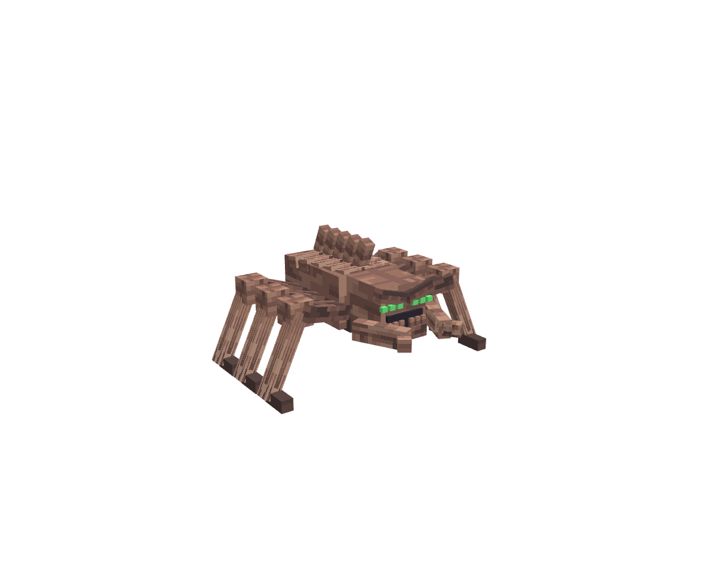
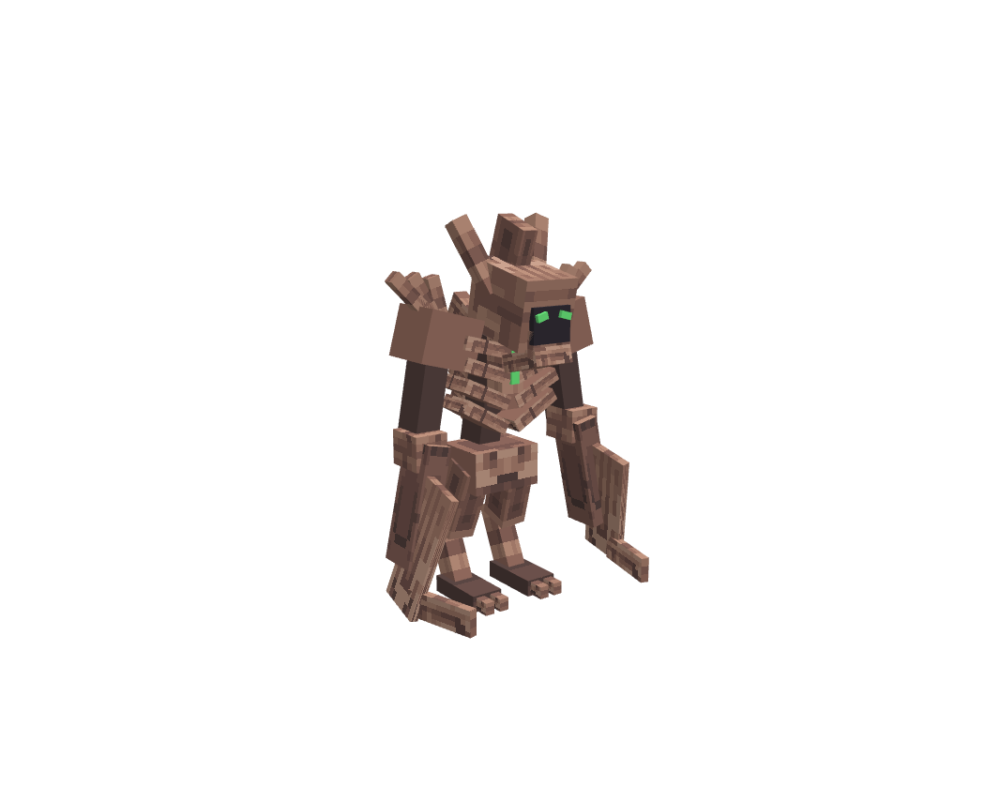
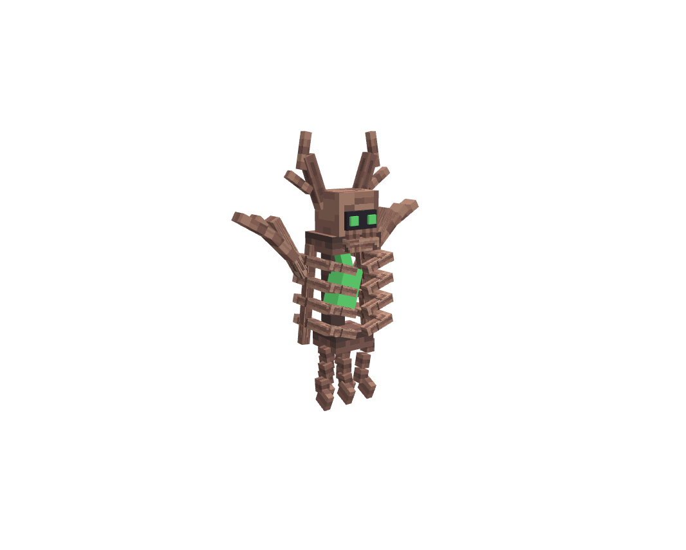

# Bone monster trio

Three regular hostile mobs, authored through the running Blockbench MCP plugin. They use the exact existing Kotsukage bone texture atlas, with opaque per-face UV mapping and green soul accents. They have no boss bars or rituals.

| Monster | Combat | Health | Damage / special |
|---|---|---:|---:|
| Grave Skitter | Six-legged bone crawler; winds up and leaps toward its target, with one damage hit per pounce. | 24 | 4 / 7 |
| Sickleghast | Tall, reverse-jointed ghoul with paired scythe forearms; close-range strikes and a wider frontal cleave. | 40 | 6 / 9 |
| Dirge Lantern | Flying ribcage with a suspended soul and dangling vertebrae; marks a location, then bursts after a dodgeable windup. | 28 | 4 / 7 |

Damage and cooldowns run on the server. Soul-particle tells run on clients and respect the existing `vfx_density` presentation setting. Attacks check line of sight and exclude creative/spectator players, allies, and the other members of this trio. Reloading a saved creature preserves its health and cancels unfinished attacks.

## Spawn and configuration

Spawn eggs are in the mod's creative tab. Commands:

```mcfunction
/summon remnants:grave_skitter ~ ~ ~
/summon remnants:sickleghast ~ ~ ~
/summon remnants:dirge_lantern ~ ~ ~
```

These mobs are currently available through eggs and commands; this change does not add natural biome spawning.

Jauml generates these config files on startup:

```text
config/remnant/monsters/grave_skitter.json
config/remnant/monsters/sickleghast.json
config/remnant/monsters/dirge_lantern.json
```

Each exposes `max_health`, `attack_damage`, `armor`, `movement_speed`, `attack_cooldown_ticks`, `special_damage`, `special_range`, and `xp_reward`. Existing values are preserved during bootstrap. Restart after editing; health/armor/speed/XP are applied when an entity first ticks or reloads, while attacks consult the loaded configuration during combat. Defaults also work without Jauml.

## Assets and previews

Each monster folder contains an editable `.bbmodel`, GeckoLib `.geo.json`, `.animation.json`, original PNG atlas, `preview.png`, `special.png`, and an `animation_preview.mp4` captured from Blockbench. Animations: idle, walk, attack, special, hurt, death. Motion is sampled at 24 FPS with eased transitions, matching loop endpoints, and a held final death pose. Preview recordings are 12 FPS.

- [Grave Skitter model](grave_skitter/grave_skitter.bbmodel) · [Animation reel](grave_skitter/animation_preview.mp4)
- [Sickleghast model](sickleghast/sickleghast.bbmodel) · [Animation reel](sickleghast/animation_preview.mp4)
- [Dirge Lantern model](dirge_lantern/dirge_lantern.bbmodel) · [Animation reel](dirge_lantern/animation_preview.mp4)





## Builds and validation

- [Fabric 1.20.1](../../1.20.1/fabric/build/libs/remnant_bosses-fabric-1.20.1-2.6.0.jar)
- [Forge 1.20.1](../../1.20.1/forge/build/libs/remnant_bosses-forge-1.20.1-2.6.0.jar)
- [Fabric 1.21.1](../../1.21.1/fabric/build/libs/remnant_bosses-fabric-1.21.1-2.6.0.jar)
- [NeoForge 1.21.1](../../1.21.1/neoforge/build/libs/remnant_bosses-neoforge-1.21.1-2.6.0.jar)

All four Gradle builds pass. `python tools/verify_bone_monsters.py` checks parent cycles, unique bones, opaque UV regions, original texture identity, clip names, finite keyframes, timing limits, 24 FPS frame spacing, loop seams, matching resources between versions, loader bindings, and the final jars. Models and windup poses were visually inspected in Blockbench. In-game combat and balance have not yet been playtested.

## MCP version check

On 2026-09-22 the installed and running Blockbench MCP was version 1.7.0, identical to the latest published script at https://jasonjgardner.github.io/blockbench-mcp-plugin/mcp.js. Both files have SHA-256 `ff265bebbadd779374d69edb380041267f2d9a60cbdc9465a94005da2e1068fa`. No replacement or restart was needed.

Rebuild the models with `python tools/build_bone_monsters.py` while Blockbench MCP is running on port 3000. This creates new project tabs. Generate fresh preview reels with `python tools/preview_bone_monsters.py` (requires ffmpeg). Model exports are copied into both Minecraft resource trees.
